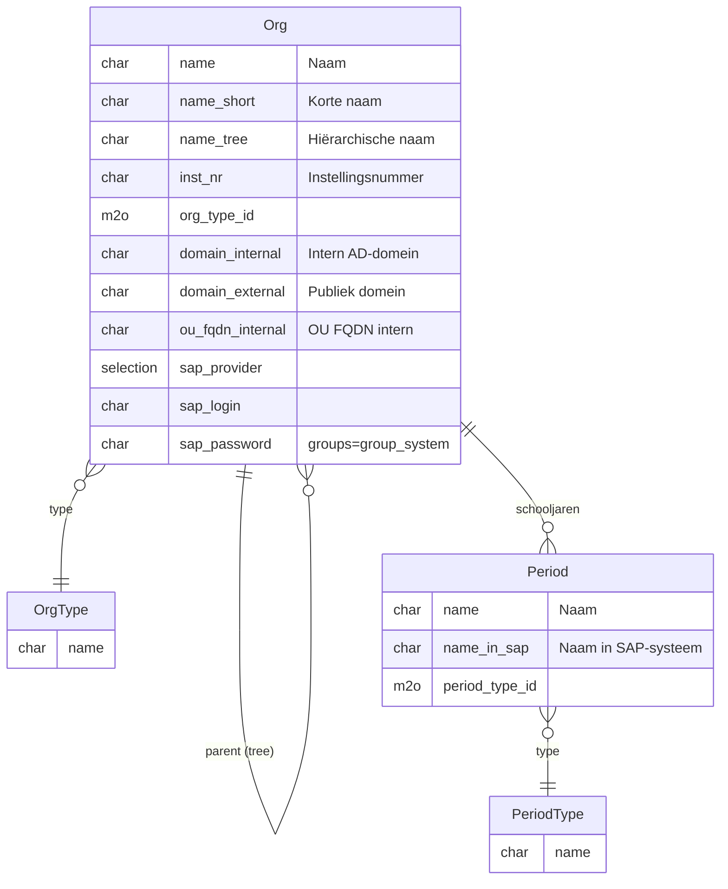
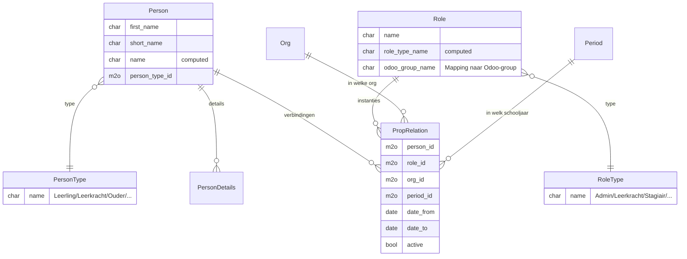
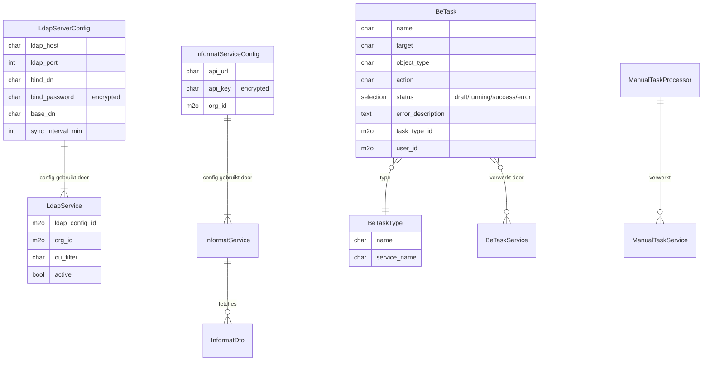
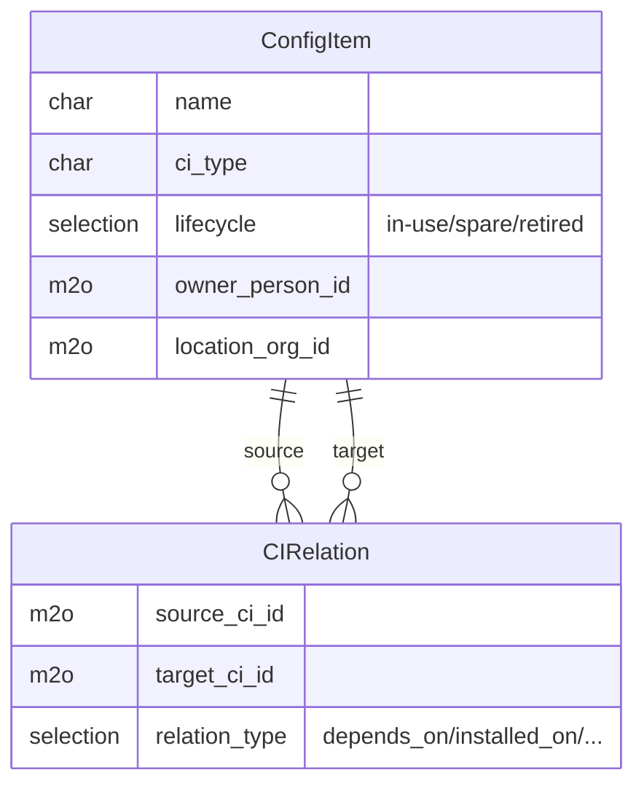

# Data-model

Kern-entiteiten van het MySchool-platform en hun relaties. Gebaseerd op `myschool_core/models/`. Andere modules (admin, activiteiten, appfoundry, ...) breiden uit op deze fundamenten.

⚠️ Niet exhaustief — focus op de structuur-bepalende entiteiten. Voor volledig veld-overzicht: zie de Python-models zelf in `myschool_core/models/`.

## Kern-entiteiten

### Organisatie-laag

**`Org`** = school-organisatie. Kan in tree-structuur (parent_id) staan voor groepering van zelfde overkoepelende organisatie. Bevat AD/domein-config zodat user-sync per org weet welke OU te targeten.

**`Period`** = schooljaar of trimester. Wordt gekoppeld aan `proprelation` (wie heeft welke rol in welk schooljaar).

### Persoon + rol-laag

**Kernontwerp**: `PropRelation` is de centrale **4-weg-link** tussen Persoon × Rol × Organisatie × Periode. Eén persoon kan tegelijk leerkracht zijn in school A (periode 2025) én admin in school B (periode 2026). De `proprelation`-records modelleren dat zonder de Person-records te dupliceren.

Dit is een typische multi-tenant + multi-role-pattern voor onderwijs-organisaties.

### Service-laag (LDAP + sync + tasks)

**`LdapServerConfig` + `LdapService`**: per organisatie (school) kan een LDAP-bind naar AD-DC ingesteld worden. Sync trekt user-data + groepen.

**`InformatService`**: integratie met externe Informat school-administratie-systeem (Vlaams onderwijs). Periodieke sync via XML-API.

**`BeTask`**: background-task framework. Alle long-running operaties (rapporten, syncs, bulk-acties) lopen als BeTask records met status-tracking, retry-policy, audit-trail via `mail.thread`.

### CMDB-laag (config items)

**`ConfigItem`** + **`CIRelation`** vormen een lichte CMDB binnen `myschool_core`. `myschool_asset` biedt een rijkere asset-management-UI hier bovenop.

## Extension-laag (per module)

Modules bovenop `core` voegen hun eigen entiteiten toe:

| Module | Belangrijkste entiteiten |
|---|---|
| `myschool_admin` | Admin-views op core (geen eigen models, alleen UI + wizards) |
| `myschool_appfoundry` | `Project`, `Item` (story/bug/task/improvement), `Stage`, `Sprint`, `Release`, `Tag` |
| `myschool_devhub` | Vergelijkbaar met appfoundry + process-flow per project |
| `myschool_itsm` | `Ticket`/`Incident`, `Change`, `KnowledgeArticle`, gebruikt `myschool_asset.Asset` |
| `myschool_asset` | `Asset`, lifecycle-tracking |
| `activiteiten` | `Activiteit`, `KostenLine`, `BusAssignment`, `OrgStudents` (snapshot) |
| `planner` | `Planner`, `VervangingLine`, `Tijdslot` |
| `professionalisering` | `ProfessionaliseringsAanvraag`, budget-lines |
| `process_mapper` | Process-flows (BPMN-achtig), prompt-templates |
| `knowledge_builder` | KnowledgeObject + Step |

Voor full details per module: zie [`../modules/`](../modules/).

## Cross-cutting

### Multi-company (Odoo standaard)

Odoo's `res.company`-model wordt gebruikt voor multi-tenancy op infra-niveau. Per `Org` is er normaal één company (of meerdere companies per org bij grote koepels).

Records met `company_id` field zijn company-scoped (Odoo's record rules zorgen voor isolatie).

### Mail.thread (chatter)

Veel kernentiteiten erven van `mail.thread` zodat ze:
- Chatter-historie hebben (audit-trail)
- Followers + notificaties ondersteunen
- Wijzigingen worden gelogd

Bij MCP-toolcalls verschijnen acties als chatter-entries onder de echte user (zie [`mcp-architecture.md`](mcp-architecture.md)).

### Sys event (audit)

`sys.event` (uit een module die hier niet beschreven is, mogelijk in core) is de centrale audit-log:

- `MCP-CALL` voor MCP-tool-executions
- `MCP-ERROR` voor MCP-failures
- Andere `source`-prefixes voor andere subsystemen

UI: **Operations → Systeemevents → Alle events**.

## Migraties

Schema-evolutie via Odoo's `migrations/<version>/`-folders per module. Voorbeeld: `activiteiten/migrations/1.9/post-migrate.py` voor pre-1.9 → 1.9 data-transformatie.

Best-practice bij schema-wijziging:
1. Wijzig `__manifest__.py` `version`-bump
2. Schrijf `pre-migrate.py` (vóór schema-update) en/of `post-migrate.py` (na)
3. Test in lokale dev-DB met `odoo -u <module> -d <db>`
4. Promote via [`../operations/branch-promote.md`](../operations/branch-promote.md)

## Open punten

- **Data-dictionary** per module ontbreekt (alleen aggregaat-overzicht hier)
- **ER-diagram volledig** (alle modules) is veel werk — huidige Mermaid covert alleen core
- **`Person` ↔ `hr.employee` ↔ `res.users`** mapping is impliciet — heeft documentatie verdiend
- **`ConfigItem` vs `myschool_asset.Asset`** verhouding is dubbelzinnig — kandidaat voor refactor of duidelijker boundary
