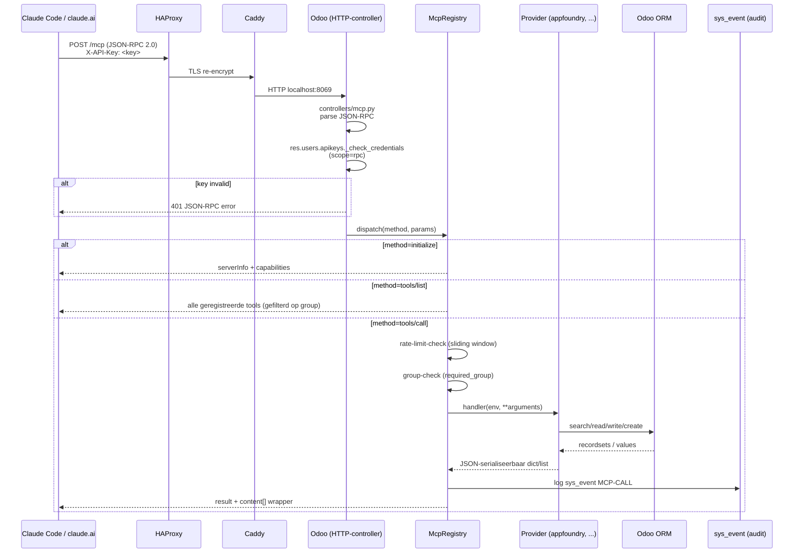

# MCP-architectuur

Hoe `myschool_mcp` werkt: van inkomend HTTP-request tot uitgevoerde Odoo-actie en MCP-respons. Voor wie nieuwe tools wil schrijven of begrijpen waarom het pattern zo gekozen is.

Verwante: [ADR 0001 — MCP als Odoo-module](../decisions/0001-mcp-as-odoo-module.md) (waarom geen aparte service); [`../../myschool_mcp/DEVELOPER.md`](../../myschool_mcp/DEVELOPER.md) (volledige developer-guide met code-voorbeelden).

## Request-flow



## Lagen

### 1. HTTP-controller (`controllers/mcp.py`)

Eén endpoint: `POST /mcp`. Doet:

- JSON-RPC 2.0 parsing (jsonrpc, id, method, params)
- Auth-check op `X-API-Key`-header via `res.users.apikeys._check_credentials(scope='rpc')`
- User-context-switch: `env = env(user=<authenticated user>)` — alles in deze request loopt onder die user
- Method-dispatch:
  - `initialize` — handshake, geen auth
  - `notifications/initialized` — ack
  - `ping` — health
  - `tools/list` — lijst van tools waarvoor user toegang heeft
  - `tools/call` — invoke een tool

Errors worden netjes naar JSON-RPC error-objecten gemapt (code/message/data).

### 2. Registry (`models/mcp_registry.py`)

Singleton die tools registreert + dispatcht. Eén klasse `McpRegistry` met:

- `@McpRegistry.tool(name, description, input_schema, required_group)` — decorator om een tool te registreren
- `.dispatch(method, params, env)` — voert de juiste handler uit
- Rate-limit: sliding-window-counter per user (default 60/min, instelbaar via Settings)
- Audit-hook: na elke geslaagde call → `sys_event` met code `MCP-CALL` (chatter-zichtbaar onder de user)

Singleton-pattern: registratie gebeurt bij module-import, niet bij elke request. Alle providers worden geladen via `providers/__init__.py`.

### 3. Provider-bestanden (`providers/<naam>.py`)

Eén bestand per logische groep tools. Voorbeeld: `providers/appfoundry.py` heeft 14 tools voor AppFoundry. Verschillende providers:

- **`base.py`** — helpers (geen tools): `resolve_item` (id of code), `resolve_project`, `resolve_stage`, `serialize_*`, markdown→HTML
- **`appfoundry.py`** — 14 tools voor AppFoundry-data (v1)
- **Toekomstig**: `betask.py` (background tasks), `sysevent.py` (audit-search), `sap_sync.py`, `documenter.py`

Per tool:

```python
@McpRegistry.tool(
    name='appfoundry_set_stage',                              # prefix_actie pattern
    description='Move an item to another Kanban stage',
    input_schema={
        'type': 'object',
        'properties': {
            'item': {'oneOf': [{'type':'integer'}, {'type':'string'}]},
            'stage': {'type': 'string'},
        },
        'required': ['item', 'stage'],
    },
    required_group='myschool_appfoundry.group_appfoundry_manager',  # write = manager
)
def set_stage(env, item, stage):
    item_rec = base.resolve_item(env, item)
    stage_rec = base.resolve_stage(env, item_rec.project_id, stage)
    item_rec.stage_id = stage_rec
    return {'id': item_rec.id, 'stage': stage_rec.name}
```

### 4. Auth via API-key

Geen OAuth-flow, geen JWT-validation — Odoo's native `res.users.apikeys`:

- Per user: **Preferences → Account Security → New API Key**, scope `rpc`
- Key wordt Eenmalig getoond bij creatie, hashed opgeslagen
- Client stuurt `X-API-Key: <key>` header
- Controller doet `apikey._check_credentials(scope='rpc')` — returns user_id of None

**Voordeel**: gebruikers beheren hun eigen credentials, geen central token-server. **Acties zijn audit-trail-onder-eigen-naam** (chatter, sys_event).

**Nadeel**: geen scope-fragmentatie binnen één user (key heeft alle user-rechten). Geen revocation-list — disable key in UI = direct effectief.

Voor toekomstige OAuth-integratie: zie `myschool_mcp/NEXT_STEPS.md` v2-roadmap (id.olvp.be als auth-broker).

## Datapaden

### Lezen (bv. `appfoundry_list_my_items`)

```
HTTP POST /mcp
  → controller parse + auth (env.user = jij)
  → dispatch tools/call → registry rate-check + group-check
  → provider.list_my_items(env)
      env['appfoundry.item'].search([('assignee_ids','in',env.user.id), ...])
      serialize naar list-of-dicts (id, code, name, stage, ...)
  → registry wraps in content[]
  → audit sys_event(code='MCP-CALL', user=env.user, tool='appfoundry_list_my_items')
  → JSON-RPC 2.0 response
```

### Schrijven (bv. `appfoundry_post_comment`)

```
HTTP POST /mcp
  → controller parse + auth
  → dispatch tools/call → registry checks
  → provider.post_comment(env, item, message)
      item_rec = resolve_item(env, item)
      html = markdown_to_html(message)
      item_rec.message_post(body=html, message_type='comment',
                            subtype_xmlid='mail.mt_comment')
      → chatter krijgt entry onder env.user.name (zichtbaar in UI)
  → audit sys_event MCP-CALL
  → response: {ok: True, message_id: <id>}
```

## Rate-limit

Sliding-window-counter per user_id (in-memory dict in registry-singleton). Default: 60 calls/60 sec.

**Niet voor security** — om runaway-loops te dempen (Claude die per ongeluk 1000 tools/call in 10s zou doen). Voor échte abuse: relying on Odoo's HTTP-layer rate-limit (uwsgi/gunicorn).

**Multi-worker beperking**: rate-limit zit per Python-proces. Bij `workers=2` in Odoo telt elk venster per worker → 2× zoveel calls mogelijk. Voor OLVP-schaal (handvol concurrent users) acceptabel. Bij groei: migreer naar `ir.config_parameter` of Redis-counter.

## Group-model

| Group | Rol |
|---|---|
| `myschool_mcp.group_mcp_user` | Poortwachter — heeft toegang tot het `/mcp`-endpoint überhaupt |
| `myschool_appfoundry.group_appfoundry_user` | Read-toegang AppFoundry |
| `myschool_appfoundry.group_appfoundry_manager` | Write/create AppFoundry |

`group_mcp_user` is impliciet inbegrepen voor `myschool_core.group_myschool_core_admin` (school-administrators).

Per tool wordt `required_group` gecheckt op de authenticerende user. Tools waarvoor user geen toegang heeft, verschijnen niet in `tools/list` (filtering aan de server-zijde — Claude ziet alleen waar je rechten op hebt).

## Audit (`sys_event`)

Elke geslaagde tool-call:

```python
env['sys.event'].create({
    'source': 'MCP',
    'code': 'MCP-CALL',
    'user_id': env.user.id,
    'description': f'tool={tool_name} args={short_args}',
})
```

Fouten → `code='MCP-ERROR'` met traceback in description.

UI: **Operations → Systeemevents → Alle events** met filter `source=MCP`.

## Settings (admin-only)

**Settings → Technical → MCP Server Settings**:

- **Rate-limit**: N calls per X seconds
- **Provider-toggles**: appfoundry on/off zonder module-uninstall
- (Toekomst v2): SSE-stream-toggle, OAuth-config

## Nieuwe provider toevoegen — high-level

Volledige stappen + voorbeelden: [`../../myschool_mcp/DEVELOPER.md`](../../myschool_mcp/DEVELOPER.md).

Kort:

1. Maak `providers/<naam>.py`
2. Import helpers uit `base.py`
3. Decoreer functies met `@McpRegistry.tool(name='<prefix>_<actie>', ...)`
4. Voeg `from . import <naam>` toe in `providers/__init__.py`
5. Restart Odoo (module-restart is voldoende, geen `-u` nodig tenzij je models toevoegt)

Tool verschijnt automatisch in `tools/list` voor users met de required_group.

## Performance

- Module draait in-process — geen network-roundtrip naar externe service
- Recordset-serialize is de duurste stap voor lijst-tools. Voor lijsten > 100 items: gebruik `limit=` argument
- Geen connection-pooling-overhead — Odoo's bestaande worker pool serveert ook MCP-requests
- Bij multi-worker scaling: rate-limit is per-worker (zie boven)

## Test-suite

`tests/test_mcp_appfoundry.py` — 7 testcases:
- Initialize-handshake (geen auth)
- Unauth → 401
- tools/list met geldige key → 14 tools
- Unknown tool → JSON-RPC error
- `appfoundry_list_my_items` end-to-end
- `appfoundry_create_item` met validation
- `appfoundry_set_stage` + `appfoundry_post_comment` chain

Run:
```bash
odoo -d <testdb> -i myschool_mcp --test-tags myschool_mcp --stop-after-init --no-http
```
