# Module dependency-graph

Hoe de MySchool-addons aan elkaar hangen. Gegenereerd uit `__manifest__.py` `depends`-velden.

## Volledige graph

```mermaid
graph TD
    %% Odoo standaard
    base[base]
    mail[mail]
    web[web]
    hr[hr]
    muk[muk_web_theme]

    %% MySchool fundament
    base --> core[myschool_core]
    mail --> core
    hr --> core
    core --> admin[myschool_admin]
    base --> admin
    mail --> admin
    web --> admin

    %% Theme
    muk --> theme[myschool_theme]

    %% Werknemers/activiteiten
    core --> activiteiten
    mail --> activiteiten
    admin --> activiteiten
    base --> activiteiten
    activiteiten --> afwezigen
    base --> afwezigen
    activiteiten --> planner
    mail --> planner
    admin --> planner
    base --> planner
    core --> proff[professionalisering]
    hr --> proff
    mail --> proff
    base --> proff

    %% Dashboard
    core --> dash[myschool_dashboard]
    proff --> dash
    activiteiten --> dash
    base --> dash

    %% Project + service
    core --> appfoundry[myschool_appfoundry]
    appfoundry --> mcp[myschool_mcp]
    core --> mcp
    mail --> mcp
    core --> devhub[myschool_devhub]
    mail --> devhub
    base --> devhub
    pm[process_mapper] --> devhub
    base --> pm
    web --> pm
    core --> pm
    core --> asset[myschool_asset]
    mail --> asset
    core --> itsm[myschool_itsm]
    asset --> itsm
    mail --> itsm
    base --> kb[knowledge_builder]
    web --> kb
    mail --> kb

    %% Sync
    core --> sync[myschool_sync]
    admin --> sync

    %% Security
    base --> phishing[security_phishing]
    mail --> phishing

    classDef odoo fill:#e8e8e8,stroke:#666,color:#333
    classDef fundament fill:#cfe2ff,stroke:#0d6efd,color:#000
    classDef werknemers fill:#d1e7dd,stroke:#198754,color:#000
    classDef project fill:#fff3cd,stroke:#fd7e14,color:#000
    classDef ai fill:#f8d7da,stroke:#dc3545,color:#000
    classDef security fill:#e2e3e5,stroke:#6c757d,color:#000

    class base,mail,web,hr,muk odoo
    class core,admin,theme,sync fundament
    class activiteiten,afwezigen,planner,proff,dash werknemers
    class appfoundry,devhub,asset,itsm,pm,kb project
    class mcp ai
    class phishing security
```

## Per-module deps (uit manifests)

| Module | Depends on |
|---|---|
| `myschool_core` | `base`, `mail`, `hr` |
| `myschool_admin` | `base`, `mail`, `myschool_core`, `web` |
| `myschool_theme` | `muk_web_theme` (community-addon) |
| `myschool_sync` | `myschool_core`, `myschool_admin` |
| `myschool_dashboard` | `base`, `myschool_core`, `professionalisering`, `activiteiten` |
| `activiteiten` | `base`, `mail`, `myschool_core`, `myschool_admin` |
| `afwezigen` | `base`, `activiteiten` |
| `planner` | `base`, `mail`, `myschool_admin`, `activiteiten` |
| `professionalisering` | `base`, `mail`, `hr`, `myschool_core` |
| `myschool_appfoundry` | `base`, `mail`, `myschool_core`, `myschool_theme` |
| `myschool_devhub` | `base`, `mail`, `myschool_core`, `process_mapper` |
| `myschool_itsm` | `myschool_core`, `myschool_asset`, `mail` |
| `myschool_asset` | `myschool_core`, `mail` |
| `process_mapper` | `base`, `web`, `myschool_core` |
| `knowledge_builder` | `base`, `web`, `mail` |
| `myschool_mcp` | `base`, `mail`, `myschool_core`, `myschool_appfoundry` |
| `security_phishing` | `base`, `mail` |

Modules zonder manifest (work-in-progress, niet installable):
- `myschool_processcomposer`
- `myschool_tasks`

## Install-volgorde (topologisch)

Bij fresh-install of major upgrade, volg deze order zodat dependencies kloppen:

1. **Odoo standaard** (base, mail, web, hr) — komt uit Odoo-image
2. **Community deps** (muk_web_theme) — los te installeren vóór myschool_theme
3. **Fundament**: myschool_core → myschool_admin → myschool_theme → myschool_sync
4. **Werknemers**: professionalisering → activiteiten → afwezigen → planner → myschool_dashboard
5. **Project + service**: process_mapper → myschool_appfoundry → myschool_devhub → myschool_asset → myschool_itsm → knowledge_builder
6. **AI**: myschool_mcp
7. **Security**: security_phishing

Odoo's auto-dependency-resolver vangt dit normaal af bij `odoo -i <module>` — de install van een module installeert eerst alle deps. Maar bij `-u all` op productie is een schone topologische volgorde nuttig om partiële states te vermijden.

## Cyclische deps

Geen cyclische deps in de huidige graph. Indien je een nieuwe module toevoegt: vermijd circular dependencies (Odoo zal die weigeren bij install).

## Externe deps

Naast Odoo-core gebruiken sommige modules externe Python-packages. Die staan niet hier in de graph maar wel in elke module's `__manifest__.py` onder `external_dependencies`. Voorbeelden:
- `myschool_core`: `ldap3` (voor LDAP-bind tegen AD)
- `myschool_mcp`: geen externe (alle deps zijn Odoo-modules)

Bij build van de Odoo-container-image worden deze pip-installed; zie `platform-ansible/roles/odoo-podman/templates/Containerfile.j2`.
