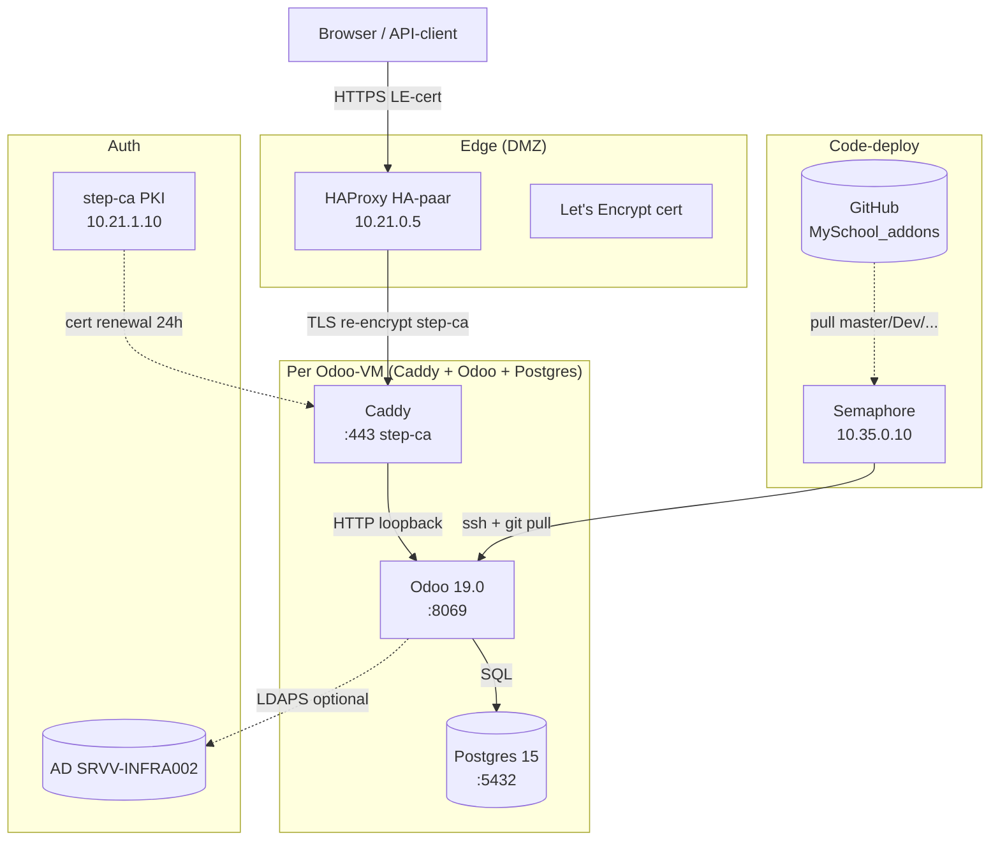

# Platform-overview

High-level architectuur van het OLVP MySchool-platform en hoe de Odoo-addons in deze repo daar in passen.

## Lagen



## Componenten

### Edge-laag (DMZ)

- **HAProxy HA-paar** in VLAN 21 met VIP `10.21.0.5`. Termineert publieke TLS met Let's Encrypt-cert. Routeert per Host-header naar de juiste Odoo-VM.
- **VRRP/keepalived** voor failover tussen `haproxy-1` en `haproxy-2`.
- **UniFi DNAT** mapt publieke IP `84.199.147.82:443` → `10.21.0.5:443`.

Details: [`platform-handbook/hosting/`](https://github.com/ictolvpbe/platform-handbook/tree/main/hosting).

### Per Odoo-VM

- **Caddy** (Podman container, `host`-network) op `:443`. TLS-re-encrypt met step-ca cert (24h validity, auto-renewal). Proxy naar Odoo op `127.0.0.1:8069`.
- **Odoo 19.0** (Podman container) draait de MySchool-addons. Bind-mounted `/opt/odoo-multi-instance/addons<N>/` voor de extra-addons.
- **Postgres 15** (Podman container) voor data-storage van die instance.

Eén VM kan meerdere Odoo-instances draaien (multi-instance pattern op SRVV-ODOO-01, SRVV-TST-ODOO-01, SRVV-ACC-01). Elk instance heeft eigen Odoo + Postgres + addons-dir.

### Auth-laag

- **step-ca** (intern PKI op SRVV-STEPCA-01, 10.21.1.10) — uitgifte van interne certs voor Caddy
- **AD-DC** (SRVV-INFRA002) — bron-van-waarheid voor identiteit. Odoo doet LDAPS-bind voor user-authenticatie waar dit aanstaat (`auth_ldap`-addon). Voor MCP/Claude-toegang gebruiken we Odoo's API-key-mechanisme — geen AD-rechtstreekse koppeling.

### Code-deploy-laag

- **GitHub** = source-of-truth voor `MySchool_addons`-repo. Branch-strategie: `master` (prod) / `Dev` (test+dev) / `Dev-<Topic>` (features).
- **Semaphore** (Podman op SRVV-SEMAPHORE-01, 10.35.0.10) runt Ansible-playbooks. "Odoo extra-addons Update"-template pullt `MySchool_addons` naar `/opt/odoo-multi-instance/addons<N>/` op de Odoo-VMs.
- Module-install/upgrade is **niet automatisch** door Semaphore — code-pull alleen. Install gebeurt via Odoo UI of CLI (`odoo -i <module>`). Zie [`../operations/module-install.md`](../operations/module-install.md).

## Datastromen

### User-request → response

```
Browser
  → DNS (one.com) → 84.199.147.82
  → UniFi DNAT → 10.21.0.5
  → HAProxy (LE-TLS)
  → Caddy (step-ca-TLS) op de juiste VM
  → Odoo HTTP-controller
  → Postgres SQL
  → response terug langs zelfde pad
```

### Code-update

```
Developer
  → git push origin Dev-<Topic>
  → Semaphore "Odoo extra-addons Update" Run (Survey-vars: target_env, override-branch, limit)
  → Ansible playbook (two-play: localhost-dispatcher + addons_target-workers)
  → git pull op de gefilterde VMs in /opt/odoo-multi-instance/addons<N>/
  → (manueel) Odoo CLI: -i <module> of -u <module>
  → systemctl restart odoo_instance_N
  → nieuwe code live
```

### MCP (Claude → Odoo)

```
Claude Code / claude.ai
  → HTTP POST <fqdn>/mcp (JSON-RPC 2.0)
  → HAProxy → Caddy → Odoo
  → controllers/mcp.py
  → X-API-Key auth (via res.users.apikeys)
  → McpRegistry.dispatch → tool execution in Odoo env
  → audit-log (sys_event MCP-CALL)
  → response back
```

## Multi-environment

| Environment | Doel | VMs | Branch |
|---|---|---|---|
| **prod** | Productie voor gebruikers | SRVV-ODOO-01 (myschool, myschool-ict, id), SRVV-ACC-01 (myschool-acc) | `master` |
| **test** | Gebruikers-test-omgeving | SRVV-TST-ODOO-01:8069 (myschool-test), SRVV-ACC-01:8070 (myschool-acc-test) | `Dev` |
| **dev** | Interne developer-test | SRVV-TST-ODOO-01:8070+8071 (id-test, myschool-dev), SRVV-TST-ODOO-02:8069 (myschool-dev2) | `Dev` |

Multi-env-VM-pattern (SRVV-TST-ODOO-01 host instances in test én dev): per-instance `env`-veld in `platform-ansible/vars/instances.yml` stuurt welke instances bij welke env-filter horen.

## Module-categorieën binnen MySchool_addons

| Categorie | Modules | Doel |
|---|---|---|
| **Core** | `myschool_core`, `myschool_admin`, `myschool_theme`, `myschool_sync` | Fundament (organisaties, personen, rollen) |
| **Werknemers** | `activiteiten`, `afwezigen`, `planner`, `professionalisering` | Activiteiten-cyclus + inhaalplannen + opleiding |
| **Project + service** | `myschool_appfoundry`, `myschool_devhub`, `myschool_itsm`, `myschool_asset`, `myschool_tasks`, `myschool_processcomposer`, `process_mapper`, `knowledge_builder` | Project-management, ITSM, BPMN |
| **AI + integratie** | `myschool_mcp` | MCP-server voor Claude |
| **Security** | `security_phishing` | Phishing-bewustwordingscampagnes |
| **Dashboard** | `myschool_dashboard` | Persoonlijk taken-dashboard |

Volledige module-lijst met deps + status: [`../modules/README.md`](../modules/README.md).

## Wat staat NIET in deze repo

- **Odoo-core en standaard-addons** (Odoo 19.0) — komt uit Odoo-image, niet uit `MySchool_addons`
- **Infrastructuur-config** (HAProxy, Caddy, Ansible-playbooks) — staat in `platform-ansible` repo
- **Architectuur-docs voor de infra-laag** — staat in `platform-handbook` repo
- **Secrets** (DB-passwords, API-keys, certs) — KeePassXC + ansible-vault, nooit in code

## Gerelateerde docs

- [`module-graph.md`](module-graph.md) — Mermaid dependencies-graph
- [`data-model.md`](data-model.md) — kern-entiteiten (TODO)
- [`mcp-architecture.md`](mcp-architecture.md) — MCP provider-pattern (TODO)
- [`platform-handbook/hosting/architecture/`](https://github.com/ictolvpbe/platform-handbook/tree/main/hosting/architecture) — infrastructuur-architectuur (overview, identity, network, security)
