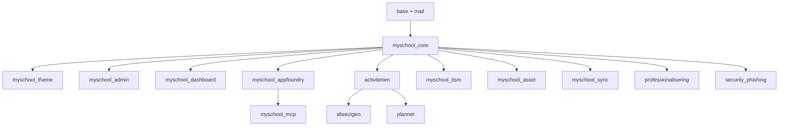

# MySchool — Modules-overzicht

Alle Odoo-addons in deze repo. Per module 1-line summary en (waar bestaand) een link naar de in-module README. Detail-documentatie (USER_MANUAL, DEVELOPER) staat in de module-dir zelf voor IDE-zoekbaarheid; deze index dient om snel het juiste vertrekpunt te vinden.

## Core + ondersteuning

| Module | Doel | Status |
|---|---|---|
| [`myschool_core`](../../myschool_core/) | School-organisaties, personen, rollen, periodes — fundament voor alle andere modules | stable |
| [`myschool_admin`](../../myschool_admin/) | Admin-laag rond core: organisaties + services-beheer | stable |
| [`myschool_theme`](../../myschool_theme/) | Teal-based backend theme voor MySchool | stable |
| [`myschool_sync`](../../myschool_sync/) | Master-slave data-replicatie tussen MySchool Odoo-instances | beta |
| [`myschool_dashboard`](../../myschool_dashboard/) | Persoonlijk dashboard met taken-overzicht per gebruiker | stable |

## Werknemers + activiteiten

| Module | Doel | Status |
|---|---|---|
| [`activiteiten`](../../activiteiten/) | Aanvragen voor interne en externe schoolactiviteiten | stable |
| [`afwezigen`](../../afwezigen/) | Overzicht van afwezige medewerkers door activiteiten | stable |
| [`planner`](../../planner/) | Inhaalplannen voor klassen die afwezig waren door activiteiten | stable |
| [`professionalisering`](../../professionalisering/) | Beheer van professionaliseringsaanvragen voor leerkrachten | stable |

## Project- + service-management

| Module | Doel | Status |
|---|---|---|
| [`myschool_appfoundry`](../../myschool_appfoundry/) | AppFoundry — development project management (items/sprints/releases) | stable |
| [`myschool_devhub`](../../myschool_devhub/) | DevHub — alternatief development-portfolio (te evalueren vs appfoundry) | beta |
| [`myschool_itsm`](../../myschool_itsm/) | ITIL 4 compliant IT Service Management | beta |
| [`myschool_asset`](../../myschool_asset/) | Asset-management voor school-omgevingen | beta |
| [`myschool_tasks`](../../myschool_tasks/) | (WIP — geen manifest) | wip |
| [`myschool_processcomposer`](../../myschool_processcomposer/) | (WIP — geen manifest) | wip |
| [`process_mapper`](../../process_mapper/) | BPMN-like business process mapping met prompt-generation | stable |
| [`knowledge_builder`](../../knowledge_builder/) | Visual knowledge object builder met step editor | beta |

## AI + integratie

| Module | Doel | Status |
|---|---|---|
| [`myschool_mcp`](../../myschool_mcp/) — [docs](myschool_mcp.md) | Model Context Protocol server — exposes MySchool aan Claude/MCP-clients | beta (niet-gedeployed) |

## Security

| Module | Doel | Status |
|---|---|---|
| [`security_phishing`](../../security_phishing/) | Interne phishing-bewustwordingscampagnes | beta |

---

## Module-dependencies (high-level)

Volledig data-model: zie [`../architecture/data-model.md`](../architecture/data-model.md) (TODO).

## Voor nieuwe modules

Wanneer je een nieuwe module toevoegt:
1. Voeg een rij toe in deze README onder de juiste categorie
2. Maak `docs/modules/<module>.md` met overzicht + crosslinks naar in-module USER_MANUAL/DEVELOPER (zie `myschool_mcp.md` als voorbeeld)
3. Update de Mermaid-graph als deps veranderen
