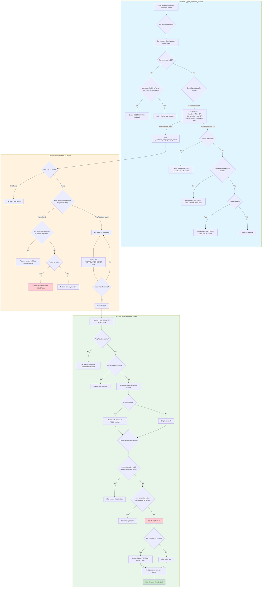

# Employee Deactivation Process Flowchart

## Key Decision Points

| Condition | Threshold | Result |
|-----------|-----------|--------|
| `pension_date` | > 1 month in past | Deactivate for instNr |
| `isActive` | false | Deactivate for instNr |
| `isOverleden` | true | Deactivate for instNr |
| `assignment.einddatum` | > 1 week in past | Skip assignment PPSBR |
| `automatic_sync` | false | Never auto-deactivate person |

## Process Summary

1. **Per-instNr Deactivation**: Employee conditions are evaluated per institution number
2. **PropRelation Tasks**: Each proprelation gets its own DEACT task
3. **Person Deactivation**: Only happens when ALL proprelations (from ALL instNrs) are inactive
4. **Guard Conditions**: `automatic_sync` must be True for automatic person deactivation
